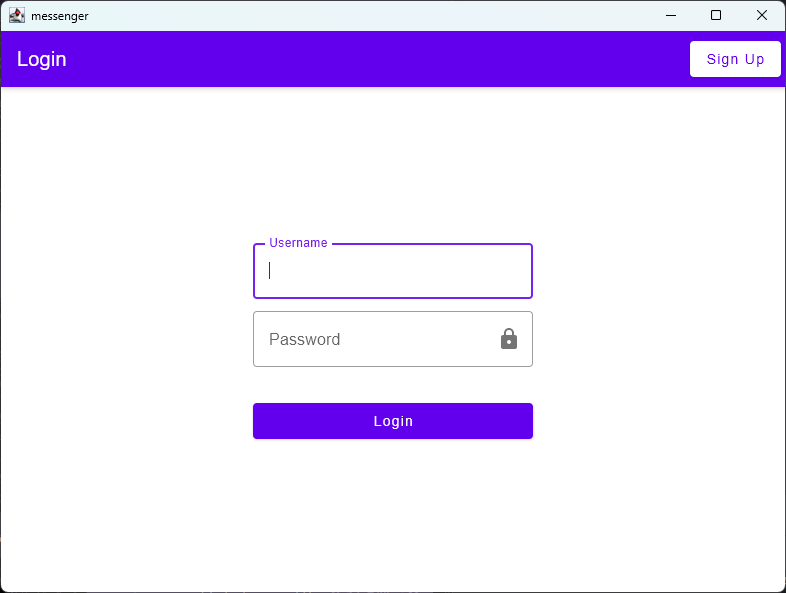
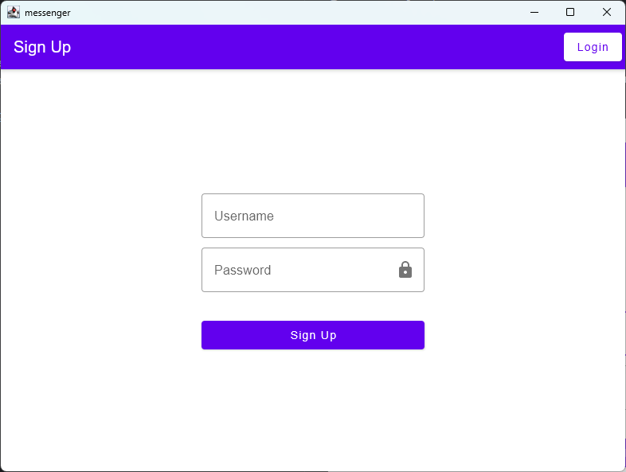
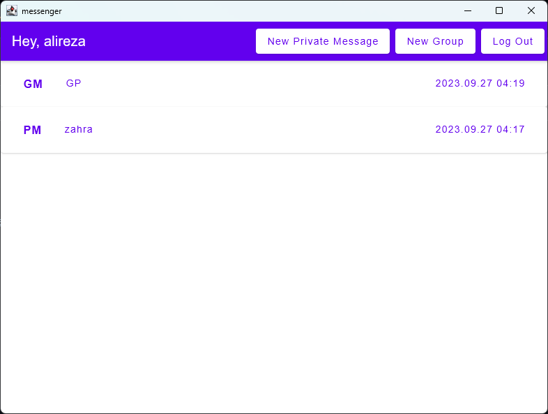
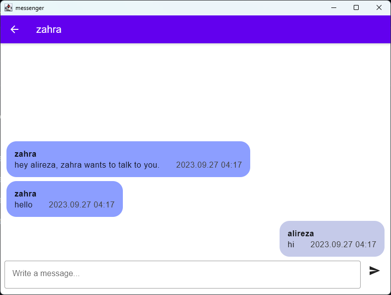
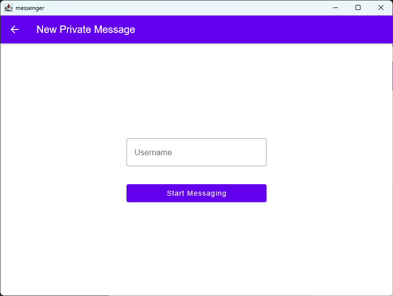
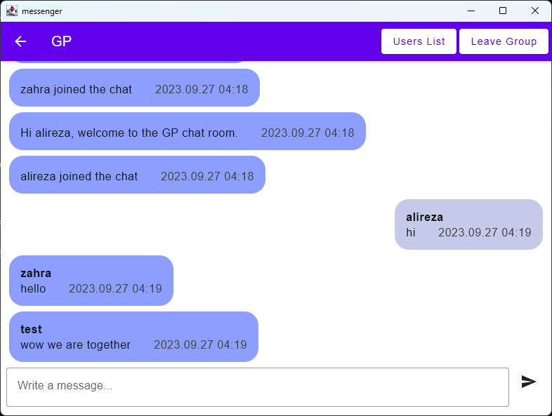
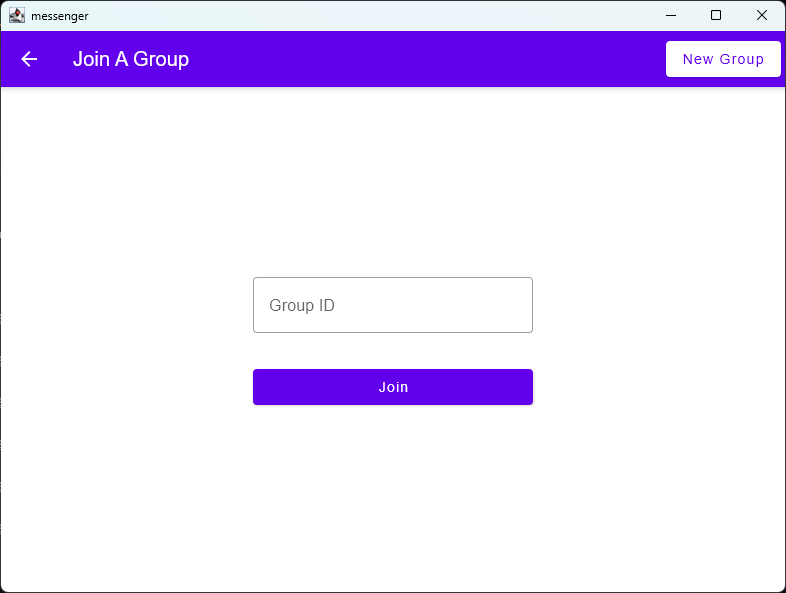
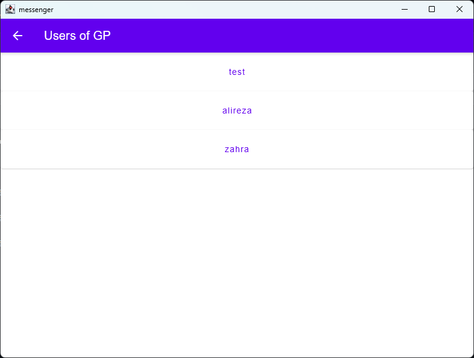

# Messenger Client

## Introduction

This is a simple messaging app which uses sockets for
communication. It was my Network lecture assignment in the university.

## Server Repository

### https://github.com/amirkazemzade/messenger_server

## Functionality

### How it works?

It uses sockets to create a live connection between the server and the clients.
The project has two sections, the Core and the UI.

### Core Section

It is written in `Java` programming language and uses its socket package for creating socket connections with server.
also it could be written in `Kotlin` since it has the ability to use `Java` packages as well, it was requested by the
lecturing teacher to use a programming language from the given languages list and `Kotlin` was not one
of them.

### UI Section:

This section uses `Compose Multiplatform` and `Kotlin` for rendering UI of the app. It is targeted for desktop platform
which includes `Windows`, `macOS` and `Linux`. Although it was only tested on `Windows` devices, there should not be a
problem running it in other desktop platforms.

## Screenshots

### Authentication Screen

You can log in to your created account or sign up for a new account.
Your chat history is saved in a database and will be loaded when you re-enter your account.

When signing up you should provide a unique username that has not been used before with a password.

### Chat List

After logging in you will be directed to the main screen of the app which shows you your chat list. You can select a
chat to navigate to it, create a new private message, join/create a group or log out of your account.

Your chat list is sorted by the date and time of the last message in that chat.

Private Messages shows with `PM` prefix and Group Messages shows with `GM` prefix.

### Private Messages

Private Messages are messages between only two users. The messages in this chat will be updated in realtime.

You can start a new private message by entering the username of the person you want to send message to.

### Group Messages

Group Messages are a place where multiple users can communicate together. The messages in this chat will also be updated
in realtime. You can also leave a group chat if you want to no longer be in it.

Each group chat has its own unique id. You can join a group chat by entering its id, or create a new group chat with
providing a unique id for it.

When you are in a group chat, you can see the list of users that are in that group chat. You can also send private
message to a group chat user by clicking on its name in the group chat users list.

